---
## Front matter
title: "Отчёта по лабораторной работе №5"
subtitle: "Дисциплина: архитектура компьютера"
author: "Маныев Ресулбег Алексеевич"

## Generic otions
lang: ru-RU
toc-title: "Содержание"

## Bibliography
bibliography: bib/cite.bib
csl: pandoc/csl/gost-r-7-0-5-2008-numeric.csl

## Pdf output format
toc: true # Table of contents
toc-depth: 2
lof: true # List of figures
lot: true # List of tables
fontsize: 12pt
linestretch: 1.5
papersize: a4
documentclass: scrreprt
## I18n polyglossia
polyglossia-lang:
  name: russian
  options:
	- spelling=modern
	- babelshorthands=true
polyglossia-otherlangs:
  name: english
## I18n babel
babel-lang: russian
babel-otherlangs: english
## Fonts
mainfont: PT Serif
romanfont: PT Serif
sansfont: PT Sans
monofont: PT Mono
mainfontoptions: Ligatures=TeX
romanfontoptions: Ligatures=TeX
sansfontoptions: Ligatures=TeX,Scale=MatchLowercase
monofontoptions: Scale=MatchLowercase,Scale=0.9
## Biblatex
biblatex: true
biblio-style: "gost-numeric"
biblatexoptions:
  - parentracker=true
  - backend=biber
  - hyperref=auto
  - language=auto
  - autolang=other*
  - citestyle=gost-numeric
## Pandoc-crossref LaTeX customization
figureTitle: "Рис."
tableTitle: "Таблица"
listingTitle: "Листинг"
lofTitle: "Список иллюстраций"
lotTitle: "Список таблиц"
lolTitle: "Листинги"
## Misc options
indent: true
header-includes:
  - \usepackage{indentfirst}
  - \usepackage{float} # keep figures where there are in the text
  - \floatplacement{figure}{H} # keep figures where there are in the text
---

# Цель работы

Целью работы является приобретение практических навыков работы в Midnight Commander. 
Освоение инструкций языка ассемблера mov и int.

# Выполнение лабораторной работы

## Знакомство с Midnight Commander

Открыл Midnight Commander (рис. [-@fig:001]) и с помощью клавиш со стрелками и Enter перешел в каталог ~/work/arch-pc. Затем нажал F7 и создал каталог lab05 (рис. [-@fig:002]).

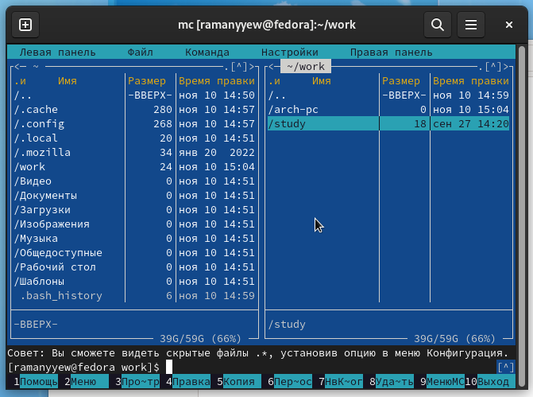{ #fig:001 width=70%, height=70% }

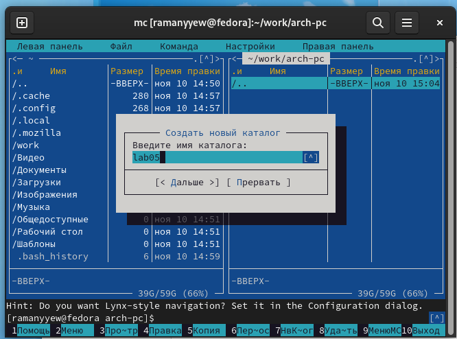{ #fig:002 width=70%, height=70% }

С использованием команды touch создал файл lab05-1.asm (рис. [-@fig:003]).

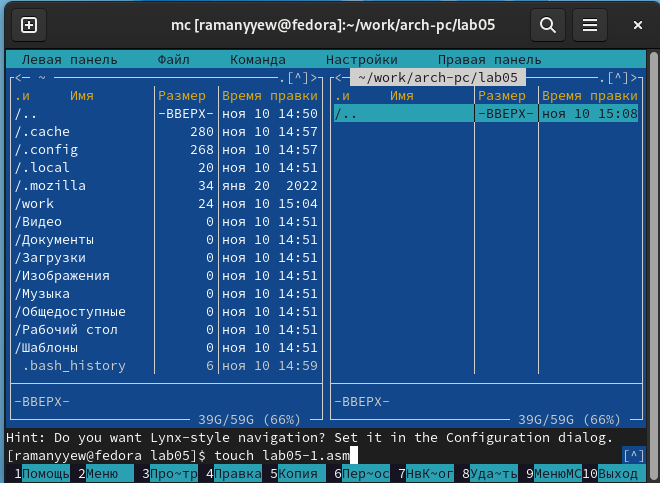{ #fig:003 width=70%, height=70% }

Открыл файл для редактирования, нажав клавишу F4, и выбрал редактор mceditor. Затем написал код программы, соответствующий заданию (рис. [-@fig:004]).

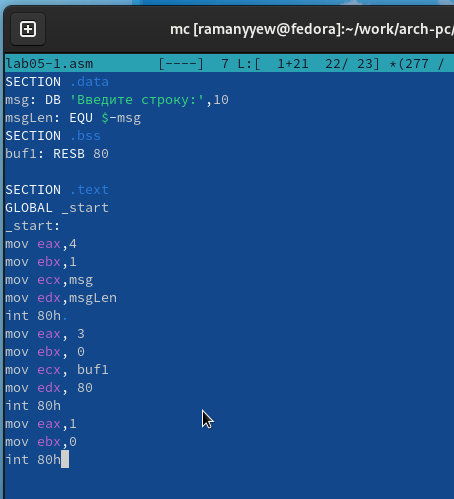{ #fig:004 width=70%, height=70% }

Открыл файл для просмотра, нажав клавишу F3, и убедился, что он содержит написанный код (рис. [-@fig:005]).

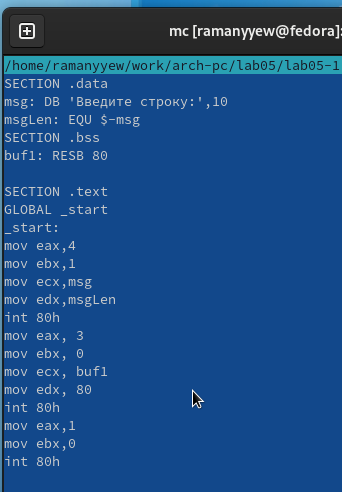{ #fig:005 width=70%, height=70% }

 С помощью трансляции файла программы в объектный файл, выполнения компановки объектного файла и получения исполняемого файла, проверил работу программы (рис. [-@fig:006]).
 
{ #fig:006 width=70%, height=70% }

## Подключение внешнего файла in_out.asm

Скачал файл in_out.asm (рис. [-@fig:007]) и разместил его в рабочем каталоге (рис. [-@fig:008]).

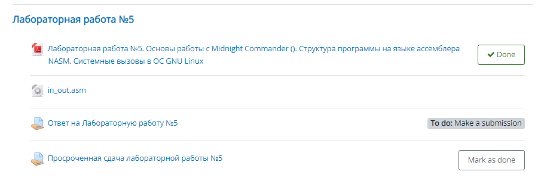{ #fig:007 width=70%, height=70% }

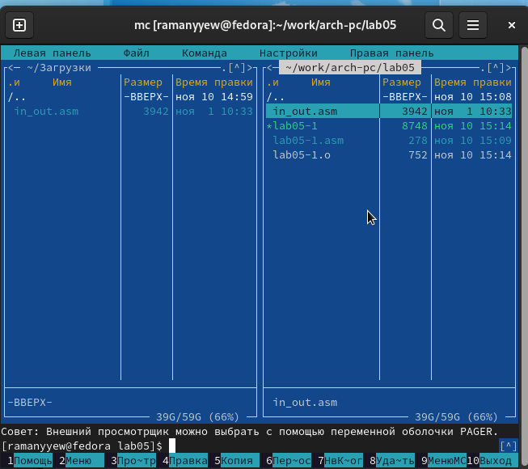{ #fig:008 width=70%, height=70% }

С использованием клавиши F5 скопировал содержимое файла lab05-1.asm в файл lab05-2.asm (рис. [-@fig:009]).

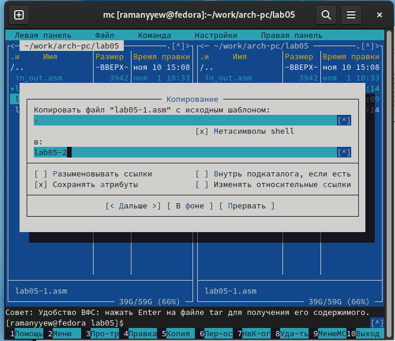{ #fig:009 width=70%, height=70% }

Написал код программы lab05-2.asm, используя подпрограммы из внешнего файла in_out.asm. (рис. [-@fig:010]) 
Затем скомпилировал программу и проверил ее запуск. (рис. [-@fig:011])

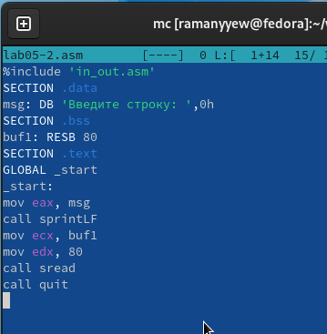{ #fig:010 width=70%, height=70% }

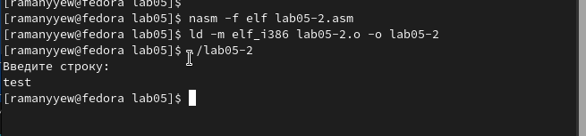{ #fig:011 width=70%, height=70% }

В файле lab05-2.asm заменил вызов подпрограммы sprintLF на sprint. (рис. [-@fig:012])
Пересобрал исполняемый файл. (рис. [-@fig:013])
Теперь после вывода строки символ перехода на новую строку отсутствует.

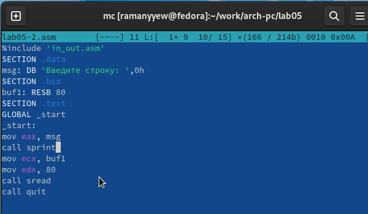{ #fig:012 width=70%, height=70% }

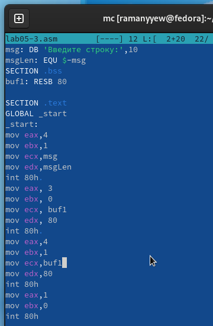{ #fig:013 width=70%, height=70% }

##  Задание для самостоятельной работы

Скопировал программу lab05-1.asm и внес изменения в код, чтобы программа работала по следующему алгоритму: 
выводила приглашение вида "Введите строку:"; считывала строку с клавиатуры; выводила введенную строку на экран.
(рис. [-@fig:014]) (рис. [-@fig:015])

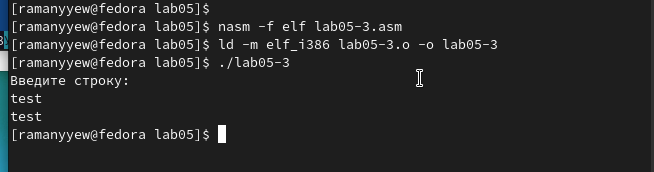{ #fig:014 width=70%, height=70% }

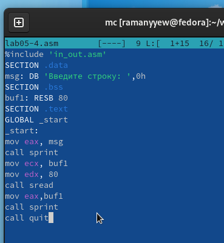{ #fig:015 width=70%, height=70% }

Аналогично скопировал программу lab05-2.asm и изменил код, но теперь использовал подпрограммы из файла 
in_out.asm. (рис. [-@fig:016]) (рис. [-@fig:017])

{ #fig:016 width=70%, height=70% }

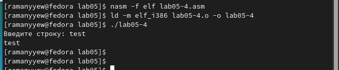{ #fig:017 width=70%, height=70% }

# Выводы

Научились писать базовые ассемблерные программы. Освоили ассемблерные инструкции mov и int.
